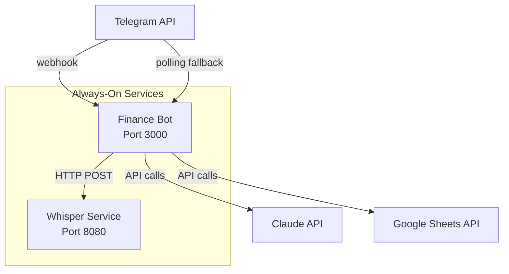
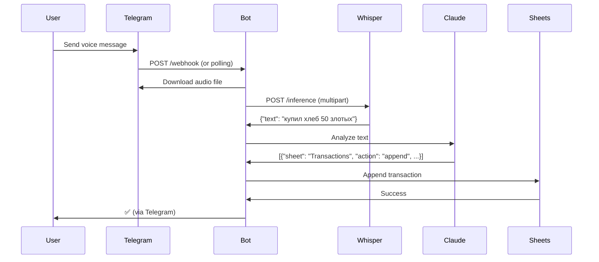
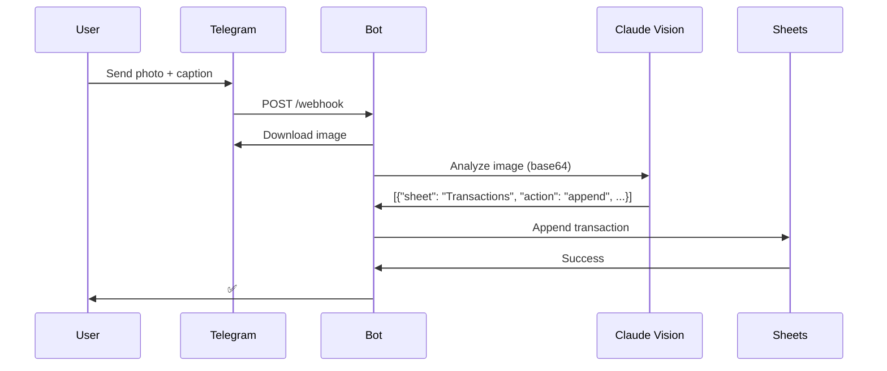
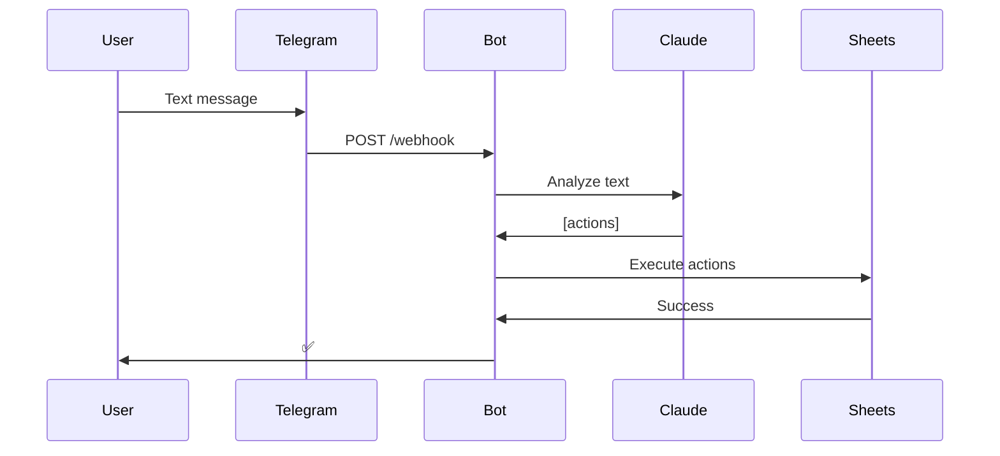

# Architecture Overview

This document describes the microservices architecture of the Personal Finance Bot system.

## System Architecture

The system consists of two independent services that communicate over HTTP:



## Service Responsibilities

### Whisper Service

**Technology**: whisper.cpp with HTTP server
**Container**: `whisper-service`
**Port**: 8080
**Restart Policy**: `unless-stopped`

**Responsibilities**:
- Loads Whisper AI model (`ggml-small.bin`) on startup
- Keeps model warm in memory for fast inference
- Exposes HTTP API endpoint: `POST /inference`
- Accepts audio files via multipart/form-data
- Returns transcription as JSON: `{"text": "..."}`
- Configured for Russian language (`-l ru`)

**Key Benefits**:
- Model loaded once, not per-request
- Isolated from bot logic
- Can be scaled independently
- Dedicated resources for AI workload

### Finance Bot Service

**Technology**: Node.js + TypeScript + Express
**Container**: `finance-bot`
**Port**: 3000
**Restart Policy**: `unless-stopped`

**Responsibilities**:
- Runs Express HTTP server for webhook endpoint
- Performs periodic polling as backup mechanism
- Downloads audio/photo files from Telegram
- Sends audio to Whisper service for transcription
- Sends text/images to Claude API for analysis
- Writes transactions to Google Sheets
- Structured JSON logging

**Key Components**:
- `src/server.ts`: Express server with `/webhook` endpoint
- `src/polling.ts`: Periodic polling with offset management
- `src/whisper.ts`: HTTP client for Whisper service
- `src/processor.ts`: Message processing orchestration
- `src/logger.ts`: Structured logging

## Operating Modes

### 1. Webhook Mode (Primary)

**Flow**:
```
User message → Telegram API → POST /webhook → Bot processes immediately
```

**Benefits**:
- Instant message processing (<1 second latency)
- No polling overhead
- Lower resource usage
- Better user experience

**Requirements**:
- Public HTTPS domain
- Webhook URL configured via Telegram API
- Port 3000 exposed and accessible

**Setup**:
```bash
export TELEGRAM_BOT_TOKEN="your-token"
export WEBHOOK_URL="https://your-domain.com/webhook"
./scripts/setup-webhook.sh
```

### 2. Polling Mode (Fallback)

**Flow**:
```
Every 5 minutes → Bot calls getUpdates → Processes new messages → Updates offset
```

**Benefits**:
- No public domain required
- Works behind NAT/firewall
- Catches missed webhook events
- Self-healing mechanism

**Configuration**:
- Interval: `POLLING_INTERVAL` env variable (default: 300000ms = 5 min)
- Offset stored in `.telegram-offset` file
- Prevents duplicate processing

### Hybrid Approach

Both modes run simultaneously:
- **Webhook**: Handles messages instantly when available
- **Polling**: Runs periodically as safety net
- **Result**: High reliability with low latency

**Failure Scenarios**:
- Webhook down → Polling catches messages within 5 minutes
- Internet outage → Polling fetches all missed messages after recovery
- Bot restart → Offset prevents reprocessing old messages

## Communication Patterns

### Voice Message Flow



### Photo Receipt Flow



### Text Message Flow



## Data Flow

### Message Processing Pipeline

```
Input → Detection → Download → AI Processing → Sheet Writing → Cleanup
```

**1. Input Detection**:
- Webhook receives update OR polling fetches updates
- Parse update to extract message
- Determine message type (text/photo/voice)

**2. Download**:
- Text: No download needed
- Photo: Download and encode as base64
- Voice: Download to temporary file

**3. AI Processing**:
- Voice: Send to Whisper → transcribe → send to Claude
- Photo: Send to Claude Vision with optional caption
- Text: Send directly to Claude

**4. Sheet Writing**:
- Claude returns structured actions
- Execute append operation on Transactions sheet
- Formula for PLN conversion applied automatically

**5. Cleanup**:
- Delete temporary audio files
- Log results
- Update offset (if polling)

## Resilience Features

### Auto-Restart

Both services configured with `restart: unless-stopped`:
- Automatic recovery from crashes
- Survives system reboots
- No manual intervention needed

### Health Checks

Whisper service has health check:
```yaml
healthcheck:
  test: ["CMD", "curl", "-f", "http://localhost:8080/"]
  interval: 30s
  timeout: 10s
  retries: 3
  start_period: 10s
```

Bot service depends on Whisper health:
```yaml
depends_on:
  whisper-service:
    condition: service_healthy
```

### Retry Logic

Whisper HTTP client retries failed requests:
- Max retries: 3
- Exponential backoff: 1s, 2s, 4s
- Timeout per request: 30s
- Logs all retry attempts

### Log Rotation

Both services use JSON file logging with rotation:
```yaml
logging:
  driver: "json-file"
  options:
    max-size: "10m"
    max-file: "3"
```

Prevents disk space exhaustion (max 30MB per service).

### Offset Persistence

Polling offset stored in `.telegram-offset` volume:
- Survives container restarts
- Prevents message reprocessing
- Shared between bot instances (if scaled)

## Structured Logging

All logs output as JSON with consistent schema:

```json
{
  "timestamp": "2024-01-15T10:30:45.123Z",
  "level": "info",
  "service": "finance-bot",
  "message": "Message processed successfully",
  "messageId": 12345,
  "type": "Voice",
  "actionCount": 1
}
```

**Log Levels**:
- `info`: Normal operations
- `warn`: Recoverable issues
- `error`: Failed operations

**Metadata Fields**:
- `messageId`: Telegram message ID
- `updateId`: Telegram update ID
- `error`: Error message (for errors)
- Custom fields per operation

**Benefits**:
- Easy parsing with `jq`
- Centralized log aggregation ready
- Structured filtering and search
- Production monitoring compatible

## Scalability Considerations

### Current Architecture (Single Instance)

- One Whisper service instance
- One Bot service instance
- Suitable for personal/small team use
- Handles dozens of messages per minute

### Horizontal Scaling (Future)

**Bot Service**:
- ✅ Can scale: Stateless except offset file
- Use external offset store (Redis/DB)
- Load balance webhook requests
- Multiple polling instances with leader election

**Whisper Service**:
- ✅ Can scale: Stateless inference
- Load balance with round-robin/least-connections
- Each instance loads model independently
- Requires ~2GB RAM per instance

### Vertical Scaling

**Whisper Service**:
- Larger models: medium/large for better accuracy
- More CPU cores for faster transcription
- GPU support for 10x speed improvement

**Bot Service**:
- More memory for concurrent processing
- Faster CPU for Claude API response parsing

## Security Considerations

### Webhook Security

**Current**: Basic HTTPS endpoint
**Recommended Improvements**:
- Validate `X-Telegram-Bot-Api-Secret-Token` header
- IP whitelist for Telegram servers
- Rate limiting on webhook endpoint
- Request signature verification

### Secrets Management

**Current**: Environment variables + mounted files
**Production Recommendations**:
- Use Docker secrets
- Kubernetes secrets
- HashiCorp Vault
- AWS Secrets Manager

### Network Isolation

**Current**: Default Docker network
**Production Recommendations**:
- Private network for Whisper ↔ Bot communication
- Expose only webhook port (3000) publicly
- Firewall rules for Telegram IP ranges

## Monitoring and Observability

### Health Endpoints

- **Bot**: `GET http://localhost:3000/health`
- **Whisper**: `GET http://localhost:8080/` (health check)

### Key Metrics to Monitor

**Bot Service**:
- Messages processed per minute
- Processing duration (P50, P95, P99)
- Error rate by message type
- Webhook vs polling message ratio

**Whisper Service**:
- Transcription requests per minute
- Transcription duration (P50, P95, P99)
- Error rate
- Model memory usage

**System**:
- CPU usage per service
- Memory usage per service
- Disk I/O (temp files)
- Network I/O (API calls)

### Log Monitoring

Query logs with `docker-compose logs` + `jq`:

```bash
# Error messages last hour
docker-compose logs --since 1h finance-bot | jq -r 'select(.level=="error")'

# Voice message processing times
docker-compose logs finance-bot | jq -r 'select(.message=="Message processed successfully" and .type=="Voice")'

# Whisper API errors
docker-compose logs finance-bot | jq -r 'select(.message | contains("Whisper"))'
```

## Technology Stack

| Component | Technology | Purpose |
|-----------|-----------|---------|
| Bot Runtime | Node.js 20 | JavaScript execution |
| Language | TypeScript | Type safety |
| HTTP Server | Express | Webhook endpoint |
| HTTP Client | undici | Whisper API calls |
| AI - NLP | Claude API | Text/image analysis |
| AI - Speech | Whisper.cpp | Voice transcription |
| Data Storage | Google Sheets API | Transaction records |
| Container Runtime | Docker Compose | Service orchestration |
| Audio Processing | ffmpeg | Audio format conversion |

## Directory Structure

```
.
├── src/
│   ├── index.ts          # Main entry point (always-on service)
│   ├── server.ts         # Express HTTP server + webhook
│   ├── polling.ts        # Periodic polling fallback
│   ├── processor.ts      # Message processing orchestration
│   ├── whisper.ts        # Whisper HTTP client
│   ├── telegram.ts       # Telegram API client
│   ├── claude.ts         # Claude API client
│   ├── sheets.ts         # Google Sheets client
│   ├── logger.ts         # Structured logging
│   ├── config.ts         # Configuration management
│   └── types.ts          # TypeScript interfaces
├── scripts/
│   ├── download-models.sh    # Download Whisper model
│   ├── setup-webhook.sh      # Configure Telegram webhook
│   └── check-webhook.sh      # Verify webhook status
├── docs/
│   ├── ARCHITECTURE.md   # This file
│   └── DEPLOYMENT.md     # Deployment guide
├── models/               # Whisper model files (gitignored)
├── docker-compose.yml    # Service definitions
├── Dockerfile            # Bot container image
├── package.json          # Node.js dependencies
└── .env                  # Environment variables
```

## Design Decisions

### Why Microservices?

**Before**: Monolithic container with Python + Node.js
**After**: Separate services with clear boundaries

**Benefits**:
- Independent scaling
- Language specialization (Node.js for I/O, C++ for AI)
- Isolated failures
- Easier testing and deployment

### Why whisper.cpp Over Python?

**whisper.cpp advantages**:
- 4-8x faster inference
- Lower memory usage
- No Python runtime needed
- Optimized C++ implementation
- HTTP API out of the box

**Trade-offs**:
- More complex setup (model download)
- Less flexibility than Python API

### Why Hybrid Webhook + Polling?

**Webhook alone**: Fast but unreliable
**Polling alone**: Reliable but slow
**Hybrid**: Best of both worlds

**Real-world scenario**:
- Normal operation: Webhook handles 99% of messages instantly
- Network hiccup: Polling catches the 1% within 5 minutes
- Zero message loss, minimal latency

### Why Express Over Native HTTP?

**Express benefits**:
- Middleware ecosystem
- JSON parsing built-in
- Easy routing
- Production-tested
- Wide community support

**Alternative considered**: Native Node.js `http` module
**Decision**: Express simplicity outweighs minimal overhead

## Future Enhancements

### Short Term
- [ ] Webhook secret token validation
- [ ] Metrics endpoint (Prometheus format)
- [ ] Graceful shutdown (drain connections)
- [ ] Request ID tracing

### Medium Term
- [ ] Redis for distributed offset storage
- [ ] Message queue (RabbitMQ/SQS) between services
- [ ] Circuit breaker for external APIs
- [ ] OpenTelemetry instrumentation

### Long Term
- [ ] Kubernetes deployment manifests
- [ ] Multi-language support (detect language)
- [ ] Voice streaming (process while recording)
- [ ] OCR for handwritten receipts
- [ ] Budget alerts and notifications

## References

- [Telegram Bot API](https://core.telegram.org/bots/api)
- [whisper.cpp](https://github.com/ggerganov/whisper.cpp)
- [Claude API Documentation](https://docs.anthropic.com/)
- [Google Sheets API](https://developers.google.com/sheets/api)
- [Express.js](https://expressjs.com/)
